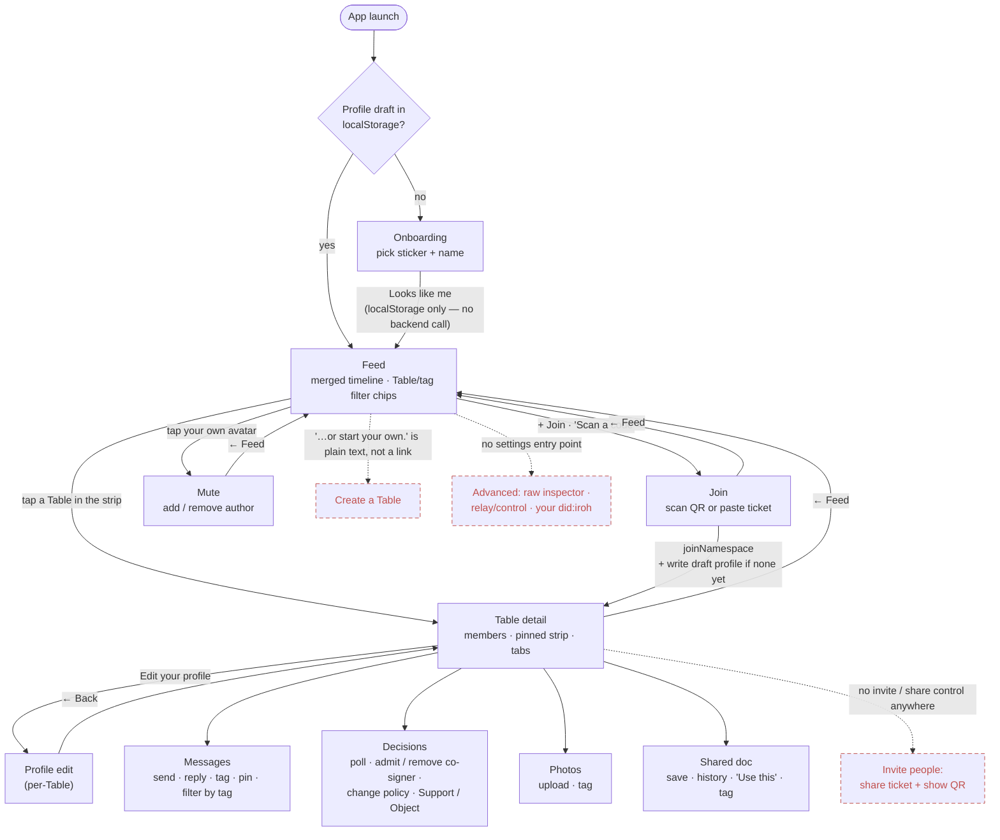
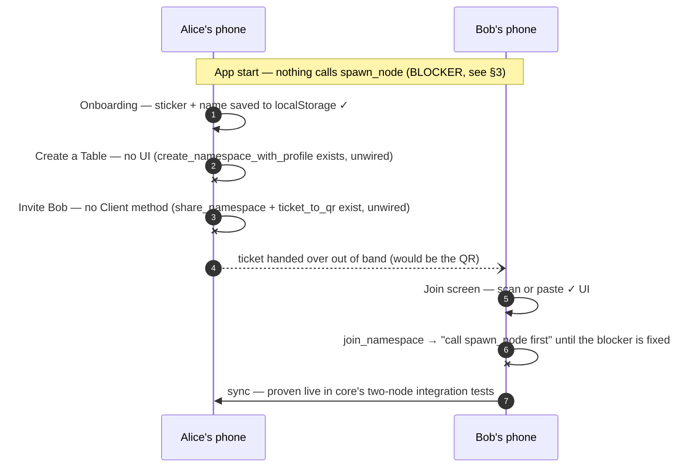

# User flow — what's actually wired (2026-09-25)

A sanity-check map of the React frontend's real navigation and backend
calls, built by reading the code: every route in `src/App.tsx`, every
`<Link to=…>` / `navigate(…)`, and every `api.*` call a screen actually
makes. It is not the design intent. It was drawn after the first on-device install
(PR #1's `e7080bd` APK), when it became obvious that a real user can't
get far on the device. Keep it current when screens or edges change.
If this map disagrees with the code, the code wins, so fix the map.

Legend: solid box = built and reachable · dashed box = **missing** (no
UI anywhere) · dotted edge = a place the UI implies a path that doesn't
exist.

## 1. Screen map

## 2. The minimum real loop, step by step

The smallest thing the app has to do for real: one person starts a
Table and a second person joins it. Here's each step's status **on a
device, against the real Tauri backend**. The mock backend used by
`npm run dev` and every test can't show any of these failures (see §4).

## 3. Gaps, ranked by how hard they block the loop

| # | Gap | Where it lives | What exists already |
|---|-----|----------------|---------------------|
| 1 | **Node is never spawned on a device.** Every Tauri command except `list_namespaces`/`node_did` returns `"call spawn_node first"`, so Join, send, tag, propose and everything else fail on a phone. | `lib.rs`'s `.setup()` only installs the mobile data dir; no screen calls `api.spawnNode()`. | `spawn_node` is idempotent and reloads every on-disk Table via `list_local_namespaces`, so one call at startup (setup hook or `App` mount) is the entire fix. |
| 2 | **No way to create a Table.** The Feed empty state promises "…or start your own." with nothing behind it. | Feed's `EmptyTablesState`; no create screen. | `create_namespace_with_profile` (founds the namespace, writes the founder's profile and real `Founding` governance record) is wired end to end through `Client.createNamespaceWithProfile`, but unused. |
| 3 | **No way to invite anyone.** Even a created Table has no ticket or QR to hand out. | No `Client` method; no UI. | `share_namespace` (Read/Write ticket) and `ticket_to_qr` (SVG) are real Tauri commands. |
| 4 | **Tables have no names on the real backend.** You'd see `Table a1b2c3d4…`. | `tauriClient.listTables`'s honest fallback. | DESIGN_BRIEF.md §9 has the proposed fix (`put_text` at a well-known `table/name` key, written by the founder). Creating a Table (#2) is the natural place to set it. |
| 5 | No Advanced surface (raw inspector, relay/control, showing your `did:iroh`). | README's "Not yet ported". | `dump_namespace`, the control endpoint, `node_did`. |

## 4. Why the tests didn't catch #1–#3

`mockClient` is a stand-in for the whole backend: its `spawnNode` is a
no-op nothing depends on, its Tables arrive pre-joined with fixture
names, and the fixture world has everyone already inside every Table.
So every screen test and every screenshot tested *being in a Table*.
None of them tested *getting into one from nothing*. Worth fixing along
with #1–#3: a test that starts from an empty mock world, creates a Table
through the UI, shares it, and joins it from a second mock "device."
Also make the mock refuse calls until `spawnNode` has run, the way the
real backend does.
