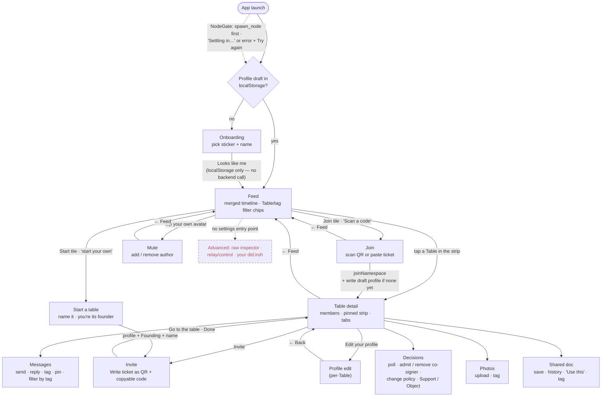
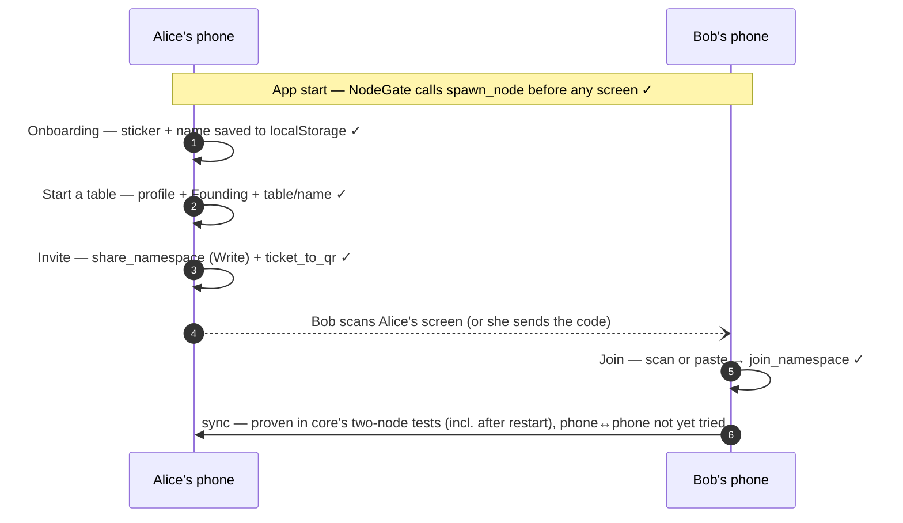

# User flow — what's actually wired (updated 2026-09-25)

A sanity-check map of the React frontend's real navigation and backend
calls, built by reading the code: every route in `src/App.tsx`, every
`<Link to=…>` / `navigate(…)`, and every `api.*` call a screen actually
makes. It is not the design intent. It was drawn after the first on-device install
(PR #1's `e7080bd` APK), when it became obvious that a real user can't
get far on the device. Keep it current when screens or edges change.
If this map disagrees with the code, the code wins, so fix the map.

Legend: solid box = built and reachable · dashed box = **missing** (no
UI anywhere) · dotted edge = a place the UI implies a path that doesn't
exist.

## 1. Screen map

## 2. The minimum real loop, step by step

The smallest thing the app has to do for real: one person starts a
Table and a second person joins it. Every step is now wired end to end
and run against the mock (`CreateTable.test.tsx`), with the Rust pieces
covered by core tests. Still unproven: two real phones reaching each
other. That's only ever been tested between two nodes on one machine.

## 3. Gaps, ranked by how hard they block the loop

**#1–#4 fixed the same day** (kept below as a record, not deleted):
`App.tsx`'s `NodeGate` calls `spawn_node` before any screen renders,
with a real error and Try again; `/new` (Start a table) and
`/table/:id/invite` (QR + copyable Write ticket) are real screens,
reachable from the Feed strip, the Feed empty state, and the Table
header; and core's `fold::write_table_name`/`read_table_name` resolve a
Table's name from genesis members only (`tests/table_name.rs` proves a
non-founder's write is ignored), surfaced by a new `list_tables`
command. #5 is still open.

| # | Gap | Where it lives | What exists already |
|---|-----|----------------|---------------------|
| 1 | **Node is never spawned on a device.** Every Tauri command except `list_namespaces`/`node_did` returns `"call spawn_node first"`, so Join, send, tag, propose and everything else fail on a phone. | `lib.rs`'s `.setup()` only installs the mobile data dir; no screen calls `api.spawnNode()`. | `spawn_node` is idempotent and reloads every on-disk Table via `list_local_namespaces`, so one call at startup (setup hook or `App` mount) is the entire fix. |
| 2 | **No way to create a Table.** The Feed empty state promises "…or start your own." with nothing behind it. | Feed's `EmptyTablesState`; no create screen. | `create_namespace_with_profile` (founds the namespace, writes the founder's profile and real `Founding` governance record) is wired end to end through `Client.createNamespaceWithProfile`, but unused. |
| 3 | **No way to invite anyone.** Even a created Table has no ticket or QR to hand out. | No `Client` method; no UI. | `share_namespace` (Read/Write ticket) and `ticket_to_qr` (SVG) are real Tauri commands. |
| 4 | **Tables have no names on the real backend.** You'd see `Table a1b2c3d4…`. | `tauriClient.listTables`'s honest fallback. | DESIGN_BRIEF.md §9 has the proposed fix (`put_text` at a well-known `table/name` key, written by the founder). Creating a Table (#2) is the natural place to set it. |
| 5 | No Advanced surface (raw inspector, relay/control, showing your `did:iroh`). | README's "Not yet ported". | `dump_namespace`, the control endpoint, `node_did`. |

**Found on a real phone (2026-09-25), all fixed**: three more gaps that
no mock-backed test could see.

| # | Gap | Cause | Fix |
|---|-----|-------|-----|
| 6 | **"This pinned message hasn't synced yet"** under a message that's plainly there; new photos stuck on "not synced yet"; Profile edit not prefilled; a founder offered no Support/Object. | The frontend's "self" was the node's network key (`did:iroh`), but records are signed by the iroh-docs *author* key. Two different keys; the mock used one hex for both. | New `self_author_hex` command; `lib/identity.ts` uses it. The mock now keeps the two keys distinct (`SELF_NODE_HEX` vs `SELF_AUTHOR_HEX`), and a test pins a just-sent message and checks the pin resolves after a reload (fails if the keys are mixed up again). |
| 7 | **Nothing from the other phone ever arrives.** | `Node::open_namespace` (used for every Table on restart) and `create_namespace` never started sync; iroh-docs rejects incoming sync for a namespace that isn't live (`AbortReason::NotFound`). Only join and share started it. The CLI's relay `serve` had the same bug. | Core now calls `start_sync` in both. `tests/reopen_sync.rs` restarts a node, reopens, and checks a peer's write arrives; it timed out before the fix. |
| 8 | **Open screens never update.** | Every screen fetched once on mount. | `hooks/usePoll.ts`: Table detail, tags and the shared doc refresh every 5s, the Feed every 10s, and all of them once when the app returns to the foreground. Paused while backgrounded. Optimistic sends drop out once the real record arrives. The shared doc never overwrites unsaved typing. Push on arrival (iroh-docs LiveEvents) can replace polling later; it's the same event stream the connectivity design needs. |

A Table created before names existed shows `Table 52d8eb76…`. Its
founder now gets "Name this table" in the header (and "Rename" once
named): `set_table_name` refuses non-founders, matching
`read_table_name`, which ignores them anyway.

## 4. Why the tests didn't catch #1–#3 (and what changed)

`mockClient` is a stand-in for the whole backend: its `spawnNode` is a
no-op nothing depends on, its Tables arrive pre-joined with fixture
names, and the fixture world has everyone already inside every Table.
So every screen test and every screenshot tested *being in a Table*.
None of them tested *getting into one from nothing*. Worth fixing along
with #1–#3: a test that starts from an empty mock world, creates a Table
through the UI, shares it, and joins it from a second mock "device."
Also make the mock refuse calls until `spawnNode` has run, the way the
real backend does.

**Both done**: the mock now throws "call spawn_node first" for every
Table call until spawned, and answers `nodeDid`/`listTables` with
null/empty the way the real backend does (`App.test.tsx`).
`CreateTable.test.tsx` runs the loop from nothing: start a named Table,
get a redeemable invite, land in it as a founder who can weigh in on
decisions.
